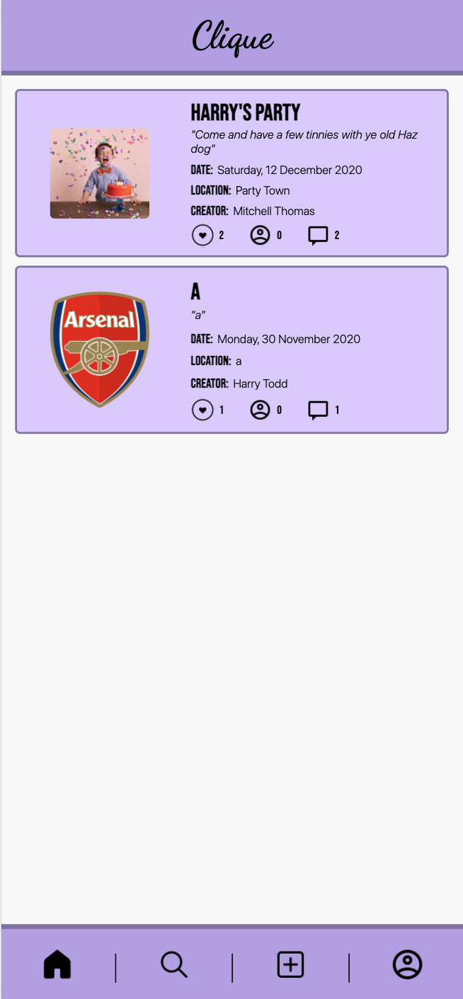
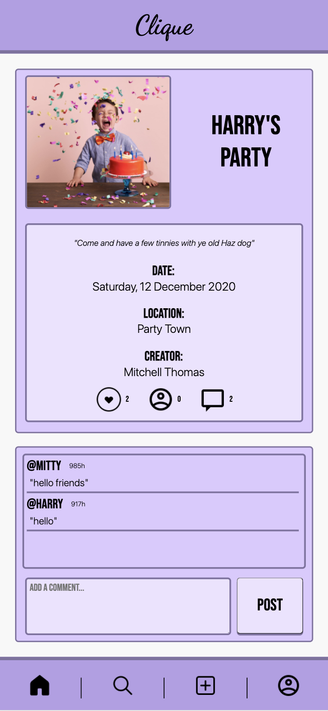
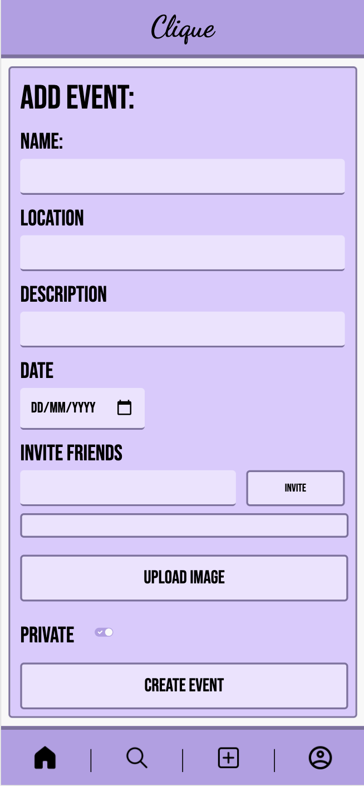

### General Assembly Software Engineering Immersive 
# Project 3 - Clique

## The Overview
This was the first extended group project we did as part of the General Assembly Course. This was our first time using tools such as Git to collaborate with one and other.

We were in a group of 4. The task was to create a full stack web app using JavaScript, ExpressJS, MongoDB and ReactJS. We had to build our own RESTful API from the ground up and use an external API if required - in our case, we did not need to use one.

You can view our project here --> ***[Clique](https://clique-app.herokuapp.com/)***   

### What is Clique?

Clique is an events orientated social media site. We aimed for Clique to be a mixture of Instagram and Facebook Events. You can create public or private events, invite friends, like and comment on events and view people's profiles.

### Technologies Used

- JavaScript
- Sass
- ExpressJS
- MongoDB / Mongoose
- ReactJS
- Heroku (for deployment)
- Git & GitHub

## The App

Myself and one other took the lead in this project. In order to work coherently as a team, we first all worked on the backend together - as we will all need to know what it does when it comes to developing our seperate frontend features. Also, as this was all of our first time developing a backend with no guidance, we thought it would be best if we all did it together in order to get a better understanding overall.

Once the backend was mostly complete, we split up and set out tasks for each other. I carried on working on the backend until it was complete.

## Our API

We wanted our API to be easy to use and to make the information as accessable as possible. Here is a sample response when GETting an event:

```json
{
  "attending": [],
  "invited": [
    {
      "firstname": "Harry",
      "lastname": "Todd",
      "username": "harry",
      "image": "https://res.cloudinary.com/dky2sqc0z/image/upload/v1605526916/1200px-User_font_awesome.svg_oa84gz.png",
      "_id": "5fb508d7e4062d0a1a54bed6"
    },
    {
      "firstname": "Sagal",
      "lastname": "Osman",
      "username": "sagal",
      "image": "https://res.cloudinary.com/dky2sqc0z/image/upload/v1605526916/1200px-User_font_awesome.svg_oa84gz.png",
      "_id": "5fb508d7e4062d0a1a54bed8"
    }
  ],
  "hosts": [],
  "notAttending": [
    {
      "firstname": "Natasha",
      "lastname": "Taylor",
      "username": "natasha",
      "image": "https://res.cloudinary.com/dky2sqc0z/image/upload/v1605526916/1200px-User_font_awesome.svg_oa84gz.png",
      "_id": "5fb508d7e4062d0a1a54bed7"
    }
  ],
  "_id": "5fb508d7e4062d0a1a54bedd",
  "eventName": "Harry's Party",
  "creator": {
    "firstname": "Mitchell",
    "lastname": "Thomas",
    "username": "mitty",
    "image": "https://res.cloudinary.com/dky2sqc0z/image/upload/v1605526916/1200px-User_font_awesome.svg_oa84gz.png",
    "_id": "5fb508d7e4062d0a1a54bed5"
  },
  "location": "Party Town",
  "photo": "https://hips.hearstapps.com/hmg-prod.s3.amazonaws.com/images/birthday-party-for-cute-child-royalty-free-image-700712598-1552358033.jpg",
  "song": "Baby shark",
  "description": "Come and have a few tinnies with ye old Haz dog",
  "likes": 18,
  "private": false,
  "date": "2020-12-12T00:00:00.000Z",
  "comments": [],
  "createdAt": "2020-11-18T11:43:19.989Z",
  "updatedAt": "2020-11-18T15:33:10.250Z",
  "__v": 3
}
```
### Mongoose Schema's

Below is an example of our user schema:

```javascript
const mongoose = require('mongoose')
const bcrypt = require('bcrypt')
const mongooseHidden = require('mongoose-hidden')
const uniqueValidator = require('mongoose-unique-validator')

const userSchema = new mongoose.Schema({
  firstname: { type: String, required: true },
  lastname: { type: String, required: true },
  username: { type: String, required: true, unique: true },
  email: { type: String, required: true, unique: true },
  password: { type: String, required: true },
  image: { type: String, required: true }
})

userSchema.plugin(uniqueValidator)
userSchema.plugin(mongooseHidden({ defaultHidden: { password: true, email: true } }))

userSchema
  .virtual('passwordConfirmation')
  .set(function setPasswordConfirmation(passwordConfirmation) {
    this._passwordConfirmation = passwordConfirmation
  })

userSchema
  .pre('validate', function checkPassword(next) {
    if (this.isModified('password') && this.password !== this._passwordConfirmation) {
      this.invalidate('passwordConfirmation', 'should match password')
    }
    next()
  })

userSchema
  .pre('save', function hashPassword(next) {
    if (this.isModified('password')) this.password = bcrypt.hashSync(this.password, bcrypt.genSaltSync())
    next()
  })

userSchema.methods.validatePassword = function validatePassword(password) {
  return bcrypt.compareSync(password, this.password)
}

module.exports = mongoose.model('User', userSchema)
```
As you can see, we used tools such as Bcrypt in order to encrypt sensitive data, such as the user's password, and keep it secure.

Here is our event schema:

```javascript
const mongoose = require('mongoose')

const commentSchema = new mongoose.Schema({
  user: { type: mongoose.Schema.ObjectId, ref: 'User', required: true },
  text: { type: String, required: true }
},
  {
    timestamps: true
  })
 
const eventsSchema = new mongoose.Schema({
  eventName: { type: String, required: true },
  location: { type: String, required: true },
  photo: { type: String, required: true },
  song: { type: String },
  comments: [commentSchema],
  description: { type: String, required: true },
  attending: [{ type: mongoose.Schema.ObjectId, ref: 'User', required: true }],
  invited: [{ type: mongoose.Schema.ObjectId, ref: 'User', required: true }],
  likes: { type: Number },
  private: { type: Boolean },
  creator: { type: mongoose.Schema.ObjectId, ref: 'User', required: true },
  hosts: [{ type: mongoose.Schema.ObjectId, ref: 'User', required: true }],
  notAttending: [{ type: mongoose.Schema.ObjectId, ref: 'User', required: true }],
  date: { type: String, required: true }
},
  {
    timestamps: true
  })

module.exports = mongoose.model('Events', eventsSchema)
```

This was a lot simpler to do than the user schema, however we did have to use an embedded relationship with the comments in order to have a 1-M relationship.

### Routes

As I said before, we started the backend together and made the simple routes below:

```javascript
router.route('/login')
  .post(userController.logIn)

router.route('/register')
  .post(userController.createUser)

router.route('/users')
  .get(userController.getAllUsers)

router.route('/user/:userId')
  .get(secureRoute, userController.getUser)
```
The start of the backend took longer than than we first expected, so I took over and tackled the slightly more intricate routes, see below:

The route:

```javascript
router.route('/events/:userId/recent-events')
  .get(secureRoute, eventController.getRecentEvents)
```

The controller:

```javascript
function getRecentEvents(req, res) {
  const userId = req.params.userId
  const currentUser = req.currentUser._id.toString()
  const currentDate = new Date()
  Events.find()
    .populate('creator attending notAttending invited hosts')
    .then(events => {
      let myEvents = []
      for (let i = 0; i < events.length; i++) {
        let permissions = false
        let creatorFilter = false
        if (events[i].creator._id.toString() === userId) {
          creatorFilter = true
        } else if (events[i].creator._id.toString() === currentUser) {
          creatorFilter = true
          permissions = true
        }
        const invitedFilter = events[i].invited.find(element => {
          if (element._id.toString() === currentUser.toString()) permissions = true
          return element._id.toString() === userId
        })
        const notAttendingFilter = events[i].notAttending.find(element => {
          if (element._id.toString() === currentUser) permissions = true
          return element._id.toString() === userId.toString()
        })
        const attendingFilter = events[i].attending.find(element => {
          if (element._id.toString() === currentUser) permissions = true
          return element._id.toString() === userId
        })
        const hostsFilter = events[i].hosts.find(element => {
          if (element._id.toString() === currentUser) permissions = true
          return element._id.toString() === userId
        })

        const isPrivate = events[i].private

        if (invitedFilter || creatorFilter || notAttendingFilter || attendingFilter || hostsFilter) {
          if (!permissions && isPrivate) {
            console.log('Private and current user not included')
          } else {
            myEvents.push(events[i])
          }
        }
      }
      return myEvents
    })
    .then(events => {
      let recentEvents = []
      for (let i = 0; i < events.length; i++) {
        if (events[i].date <= currentDate) {
          recentEvents.push(events[i])
        }
      }
      return recentEvents
    })
    .then(events => res.send(events))
    .catch(err => res.send(err))
}
```
This one was the most complicated function as I had to the events depending on if the current user is the creater, invited, attending, not attending, a host or if the event is private or not. After this I had to compare all of them in an if statement and push the relevant events to an array to then send it as a JSON response.

### Extra Backend Features
In order to add another level of security, we implimented some middleware that would check if the requester is signed in (this is done by checking if a valid token is being used).

```javascript
const jwt = require('jsonwebtoken')
const User = require('../models/userModel')
const { secret } = require('../config/environment')

function secureRoute(req, res, next) {
  const authToken = req.headers.authorization

  if (!authToken || !authToken.startsWith('Bearer')) {
    console.log('Unauthorized 1')
    return res.status(401).send({ message: 'Unauthorized 1' })
  }
  const token = authToken.replace('Bearer ', '')
  jwt.verify(token, secret, (err, payload) => {
    if (err) return res.status(401).send({ message: 'Unauthorized 2' })
    const userId = payload.sub

    User
      .findById(userId)
      .then(user => {
        if (!user) return res.status(401).send({ message: 'Unauthorized 3' })
        req.currentUser = user
        next()
      })
      .catch(() => res.status(401).send({ message: 'Unauthorized 4' }))
  })
}

module.exports = secureRoute
```
We added various levels of error messages (e.g. "Unauthorised 1") so that we can easily pinpoint where an error is.

## The Frontend

My frontend features were:

- Create the top banner and navbar:
	- These had to be able to be used globally in the frontend, so I had to make them simple and functional.
- Create the homepage:
	- This is where you scroll through various events on the page (like Instagram's homepage)
- Create the single event page:
	- Where the user can interact with the event - view all information, like, comment and say if they are attending or not.
- Add event:
	- This is where the user can create a new event and add all of the relevant information to it, incliuding a photo, whether it's public or private, who is invited, etc. 

Here is my code for the navbar:

```javascript
import React from 'react'
import { Link } from 'react-router-dom'
import { getUserId } from '../lib/UserToken'


const NavBar = () => {
  const token = localStorage.getItem('token')
  const userId = getUserId(token)

  return <footer className="navbar">
    <div className="navbar-section">
      <Link className="navbar-link" to="/home">
        <div className="navbar-home"></div>
      </Link>
    </div>
    <p className="navbar-seperator">|</p>
    <div className="navbar-section">
      <Link className="navbar-link" to="/search">
        <div className="navbar-search"></div>
      </Link>
    </div>
    <p className="navbar-seperator">|</p>
    <div className="navbar-section">
      <Link className="navbar-link" to="/events/addevent">
        <div className="navbar-add"></div>
      </Link>
    </div>
    <p className="navbar-seperator">|</p>
    <div className="navbar-section">
      <Link className="navbar-link" to={`/profile/users/${userId}`}>
        <div className="navbar-profile"></div>
      </Link>
    </div>
  </footer>
}

export default NavBar
```
In order to get the current user's ID from anywhere in the frontend, I had to create a function called getUserId in a seperate folder that I imported at the the start of the navbar:

```javascript
export function getUserId() {
  const token = localStorage.getItem('token')
  if (!token) return false

  const parsedToken = JSON.parse(atob(token.split('.')[1]))
  return parsedToken.sub
}
```
This was used across the whole frontend when we needed to determine who had made the request.

### Image Uploading

In order for users to be able to upload their event photo, I used a platform called Cloudinary. Below is a snippet where this was used in the Create Event page:

```javascript
function handleUpload() {
    window.cloudinary.createUploadWidget(
      {
        cloudName: 'dky2sqc0z',
        uploadPreset: 'clique1',
        cropping: true
      },
      (err, result) => {
        if (result.event !== 'success') {
          return
        }
        const data = {
          ...formData,
          photo: result.info.secure_url
        }
        updateFormData(data)
      }
    ).open()
  }
```
This was done using the Cloudinary documentation.

## Screenshots

Here are some screenshots of the parts I completed:

### Homepage (plus banner and navbar)



### Single Event (plus banner and navbar)



### Add Event (plus banner and navbar)



## Final Thoughts

This was the whole group's first time working in a team on a project so getting used to collaborating using Git was hard to begin with. We stuck to a commit and merge often rule that helped us the majority of the time, but the first few times were tough. Dealing with each other's merge conflicts was, again, tough to begin with but we were quick to communicate with each other and resolve them.

A few features did not get completed by my teammates as we ran out of time. In hindsight, I would have definitely set out tasks sooner distributed the work more evenly. There were team members that were just working on one component opposed to myself and one other that had multiple to do. 

As a team, our vision for the app had way too many features for 1 week's worth of work. I think now, with more experience, we would be able to improve massivly on what we had produced in the given time.

-

You can view our project here --> ***[Clique](https://clique-app.herokuapp.com/)***  

